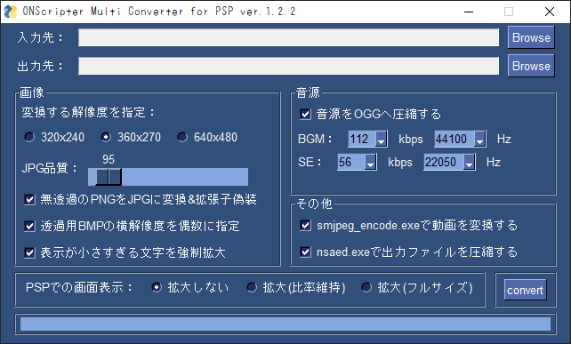

# ONScripter_Multi_Converter
## ツールについて
 ONScripter for PSP向けに~~今更~~制作された総合変換ツールです。<br>
 一応[C&D; Tools Win GUI](https://web.archive.org/web/20170419120050fw_/http://www.geocities.jp/stm_torm/ons/tool.html)の後継を目指し作りました<br>
 <br>
 元々Python完全初心者が見切り発車で始めたものなので<br>
 ソースの可読性の低さについてはご了承ください<br>

## 動作環境
 対応OS等の細かい検証は特に行っていません<br>
 多分今どきのwindowsなら普通に動くと思います<br>
 <br>
 [制作/検証に使用した作者のPC環境]<br>
 PCスペック:<br>
 [](https://valid.x86.fr/d8ltzd)<br>
 FFmpeg-version:version 6.0-full_build<br>
 Python-version:Python 3.11.3<br>
 pngquant-version:2.17.0<br>

## 動作に必要なもの
 - ["ONScripter_Multi_Converter" exe本体](https://github.com/Prince-of-sea/ONScripter_Multi_Converter/releases/latest)
 - [smjpeg_encode.exe(すとーむ様作成)](http://web.archive.org/web/20130203074100/http://www.geocities.jp/stm_torm/ons/smjpeg4.zip)
 - [nsaed.exe(すとーむ様作成)](https://web.archive.org/web/20130328141650/http://www.geocities.jp/stm_torm/nsaed2.zip)
 - [GARBro.Console(게지네様作成)](https://drive.google.com/file/d/1gH9nNRxaz8GexN0B1hWyUc3o692bkWXX/view)
 - [pngquant](https://pngquant.org/)
 - [FFmpeg](https://www.gyan.dev/ffmpeg/builds/ffmpeg-release-full.7z)
 - [NScripterで制作されたゲーム](https://erogamescape.dyndns.org/~ap2/ero/toukei_kaiseki/attlist.php?att[66]=on)(当然ですが...)

[動作確認済みタイトルはこちら](./TITLELIST.md)

## 使い方
### 変換前準備
 DLしたファイルをそれぞれの場所に展開/移動し、<br>
 最終的にファイルを以下のような配置にして準備完了です<br>
 (ディレクトリの場所は問いません)
```
[パスの通ってるディレクトリ]
   ffmpeg.exe
   ffprobe.exe
   pngquant.exe


[適当な名前のツール用ディレクトリ]
│  NSC2ONS4PSP.exe
│  
└─tools
    │  nsaed.exe
    │  smjpeg_encode.exe
    │
    └─Garbro_console
        │  GARbro.Console.exe
        │  {その他大量のファイル}
        │
        └─  {その他いくつかのディレクトリ}
```

### ツールの設定
 <br>
 ※画像は古いバージョンや開発中バージョンの場合があります

~~よくわからないなら入力/出力先だけ指定してconvert押せばいいと思います(爆)~~

#### 上段メニュー
 - **入力先**<br>
 [Browse]からゲーム用ディレクトリを指定します<br>

 - **出力先**<br>
 [Browse]から出力先の任意のディレクトリを指定します<br>
 実際は「(選択したディレクトリ)\PSP_{入力先の名前}」へ保存されます<br>
 また、ディレクトリが競合した場合**勝手に消す**ので注意！<br>

#### 画像
 - **未指定時JPG/BMP横解像度**<br>
 画像の横解像度を特定の倍数にすることによって、<br>
 "立ち絵の横に謎の縦線が表示される"不具合を回避します<br>
 デフォルトは2(の倍数)に設定してあります<br>

 - **JPG品質( -画像、-動画)**<br>
 JPGに変換された画像の品質を指定します<br>
 数値が低いほど容量が少なく、高いほど画質がきれいです<br>

 - **解像度指定(横)**<br>
 変換後のゲームの解像度を指定します<br>
 基本的には"360"のままで問題ありません<br>

 - **BMPをJPGに変換&拡張子偽装**<br>
 背景が透過されていないBMPに対して、JPG変換を行います<br>

 - **PNGの色数を削減し圧縮**<br>
 PNGを減色し、大幅に容量を減らすことが出来ます<br>
 v1.4.2で何色まで減らすかを指定できるようになりました<br>
 
#### 音源
 - **音源をOGGへ圧縮する**<br>
 FFmpegを使用し、ゲーム内の全ての音源データを変換します<br>
 BGMとSE(というかBGM以外)で別々に設定を行うことができます<br>
 (BGMとSEの区別は「パス名に"bgm"または"cd"と入っているか」＆「シナリオファイル内でBGMとして利用された形跡があるか」です)<br>

#### その他
 - **常にメモリ内にフォントを読み込んでおく**<br>
 PSPで動作させる際、常にフォントをRAMに読み込ませ、<br>
 文字表示を高速化させるかどうかの設定です<br>
 RAMの消費量が増えるためPSP-1000での利用は非推奨<br>
 (処理としてはons.iniの"FONTMEMORY"を書き換えてるだけ)<br>

 - **nsaed.exeで出力ファイルを圧縮する**<br>
 全ての画像/音源ファイルの変換処理が終了した後に、<br>
 それらを画像、BGM、BGM以外 の3つに分けて <br>
 複数の"arc.nsa"へ分割、圧縮を行います<br>

 - **表示が小さすぎる文字を強制拡大**<br>
 PSPで表示する際に小さすぎて読めないと思われる文字を<br>
 強制的に文字が潰れない程度のサイズまで拡大します<br>
 ※拡大できる文字はsetwindow命令のみです<br>

#### 下段メニュー
 - **PSPでの画面表示**<br>
 ons.iniの"SURFACE"と"ASPECT"を書き換え、<br>
 PSP表示時に画面を拡大するかどうかを選択できます<br>

 - **convert**<br>
 ここを押すと変換開始<br>

[convert]を押してしばらく(数秒～数分)待ったあと、<br>
"処理が終了しました"と表示されたら変換完了です<br>
[ONScripter for PSPのEBOOT.PBP](https://archive.org/download/ons.-7z/Old%20Versions/onscripter-20110111_psp.zip)と[default.ttf](https://www.google.com/search?q=PSP+default.ttf)を準備し、<br>
CFW/LCFW搭載のPSPまたはAdrenaline導入済PSvitaに入れてレッツプレイ<br>

## 注意事項など
### 仕様
 - "動作に必要なもの"が全て用意されていない場合起動しません

 - 本ツールを使用した際に出力されるons.iniは、<br>
 [新verのONScripter向けの記述](https://web.archive.org/web/20100709172750fw_/http://blog.livedoor.jp/tormtorm/archives/51520243.html)となっています<br>

 - 対応しているゲームの解像度は4種類のみです<br>
 以下の解像度以外は変換が行えません<br>
    - 800x600
    - 640x480
    - 400x300 ~~←正直怪しい~~
    - 320x240 ~~←これも正直怪しい~~
  
 - 解像度が対応しているゲーム作品であっても、<br>
 そのソフトが正常に動作するとは限りません<br>
 (ONSの仕様上、DLLとかlua依存の作品は無理)<br>

### CD-DAを使っているソフトについて
ONScripter側の[CD audio 演奏の振り替え機能](https://onscripter.osdn.jp/onscripter.html#cd-audio-mapping)を利用するため、<br>
先に吸い出した音源(wav)を入力先に用意しておいてください<br>
oggへの変換は本ツールが行うため事前の変換は不要です<br>

### 既知の不具合
 - MIDIの変換が行われない
    - そもそもMIDIを使った作品を筆者は利用したことがありません<br>もしかしたら現時点でも正常に動作するかも？
 - nbzに対する処理が不十分
    - nsa/sar/ns2アーカイブの外にあるnbzは処理不能
    - シナリオファイルに対し".nbz"→".wav"で一括置換をかけているため、<br>想定外の挙動が発生する可能性がある

### お約束
 - 本ツールの使用において生じた問題や不利益などについて、<br>
 製作者は一切その責任を負わないものとします<br>
 また、それらの問題を他のツールの製作者様や<br>
 メーカー/サークル様に問い合わせるのは**絶対にやめてください**<br>

### 最後に
~~...今更PSPでノベルゲームやるやついる？~~<br>