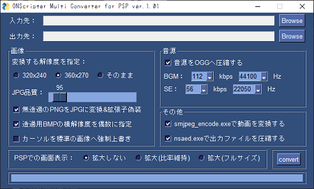

# ONScripter_Multi_Converter
## ツールについて
 ONScripter for PSP向けに制作された総合変換ツールです。<br>
 シナリオのデコードや命令の置換に文字サイズの拡大、<br>
 画像の縮小や音楽の圧縮、専用形式への動画の変換<br>
 さらにはそれらの分割/アーカイブ化まで<br>
 ONScripter for PSPに必要な処理を一括で行ないます<br>
 一応[C&D; Tools Win GUI](https://web.archive.org/web/20170419120050fw_/http://www.geocities.jp/stm_torm/ons/tool.html)の後継を目指し作りました<br>
 <br>
 元々Python完全初心者が見切り発車で始めたものなので<br>
 ソースの可読性の低さについてはご了承ください...<br>

## 特徴
 本ツールは必要なソフト含めすべてインストール不要で、<br>
 ファイルを準備しゲームを指定するだけで変換できます<br>
 画像や音楽、テキストごとに専用のソフトをDLし、<br>
 インストールして一つ一つ手動で処理する必要はありません<br>
 <br>
 また、一般的に利用されてきた汎用画像縮小ツールと違い<br>
 0.txtから画像の状態を読み取って個別処理しているため<br>
 文字ウインドウのカーソルや分割されたスプライトの縮小を<br>
 ほぼ座標ズレや透過ミスを起こさずに行えます<br>
 (命令文に独自の変数を使って表示している場合や<br>
  連番jpgなどでパス内に変数がある場合除く)<br>

## 変換可能な作品
 [こちら](./TITLELIST.md)へまとめておきました

## 動作環境
 対応OS等の細かい検証は特に行っていません<br>
 多分今どきの環境なら普通に動くと思います<br>
 展開や変換にそこそこの容量を必要とするため<br>
 最低でも変換するゲームの3倍程度の空き容量は用意してください<br>
 <br>
 [制作/検証に使用した作者のPC環境]<br>
 CPU:AMD Ryzen 5 1600AF<br>
 RAM:DDR4 3200MHz 16GB x2 (計32GB)<br>
 OS:Windows10 20H2 64bit<br>
 FFmpeg-version:2021-05-05-git-7c451b609c<br>
 Python-version:Python 3.7.7

## 動作に必要なもの
 - ["ONScripter_Multi_Converter" exe本体](https://github.com/Prince-of-sea/ONScripter_Multi_Converter/releases/latest)
 - [smjpeg_encode.exe(すとーむ様作成)](http://web.archive.org/web/20130203074100/http://www.geocities.jp/stm_torm/ons/smjpeg4.zip)
 - [nsaed.exe(すとーむ様作成)](https://web.archive.org/web/20130328141650/http://www.geocities.jp/stm_torm/nsaed2.zip)
 - [GARBro.Console(게지네様作成)](https://drive.google.com/file/d/1gH9nNRxaz8GexN0B1hWyUc3o692bkWXX/view)
 - [FFmpeg](https://www.gyan.dev/ffmpeg/builds/ffmpeg-release-full.7z)
 - [NScripterで制作されたゲーム](https://erogamescape.dyndns.org/~ap2/ero/toukei_kaiseki/attlist.php?att[66]=on)(当然ですが...)

## 使い方
### 変換前準備
 1. 上記"動作に必要なもの"をDLし、.zipや.7zは展開します<br>
 (→7zが展開できない方は[こちら](https://forest.watch.impress.co.jp/library/software/7zip/))<br>

 1. 展開したファイル内にあるFFmpeg.exeおよびFFprobe.exeを<br>
 [パスを通してあるディレクトリに置いて](https://www.google.com/search?q=FFmpeg+path+%E9%80%9A%E3%81%99)ください<br>

 1. DLした"NSC2ONS4PSP.exe"と同一の階層(同じ場所)に<br>
 "tools"という名前をつけたディレクトリを作成し、そこへ<br>
 先ほど展開した"nsaed.exe"と"smjpeg_encode.exe"を移動します<br>
 GARBro.consoleに関しては、展開後、<br>
 "展開したディレクトリごと"toolsへ置いてください<br>

 1. 最終的にファイルを以下のような配置にして準備完了です<br>
 (それぞれのディレクトリの場所は問いません)
```
[パスの通ってるディレクトリ]
   ffmpeg.exe
   ffprobe.exe


[ゲーム用ディレクトリ]
   {nscripter製のゲームデータ}


[適当な名前のツール用ディレクトリ]
│  NSC2ONS4PSP.exe
│  
└─tools
    │  nsaed.exe
    │  smjpeg_encode.exe
    │
    └─Garbro_console
        │  GARbro.Console.exe
        │  {その他大量のファイル}
        │
        └─  {その他いくつかのディレクトリ}
```

### ツールの設定
 [](./tools/md_ui_full.png)
#### 上段メニュー
 - **入力先**<br>
[Browse]からゲーム用ディレクトリを指定します<br>

 - **出力先**<br>
[Browse]から出力先の任意のディレクトリを指定します<br>
実際は「(選択したディレクトリ)\result」へ保存されます<br>
また、ディレクトリが競合した場合**勝手に消す**ので注意！<br>

#### 画像
 - **変換する解像度を指定**<br>
 ラジオボタンで変換後のゲームの解像度を指定します<br>
 基本的には"360x270"のままで問題ありませんが、<br>
 表示される画像の座標がおかしくなっている場合は、<br>
 "320x240"や"そのまま"にすると改善するかもしれません<br>
 ただし、元作品の解像度によっては"そのまま"が<br>
 PSPで動作しないことがあるので注意してください<br>

 - **JPG品質**<br>
 JPGに変換された画像の品質を指定します<br>
 数値が低いほど容量が少なく、高いほど画質がきれいです<br>
 初期値は"人の目には劣化がわからない"とされる95を指定してます<br>
 96以上は見た目がほぼ変わらない割に容量が激増するので非推奨<br>
 また、85を下回った辺りから大幅に画質が低下するため要注意<br>

 - **無透過のPNGをJPGに変換&拡張子偽装**<br>
 背景が透過されていないPNGに対して、JPG変換を行います<br>
 ただし、シナリオ側のパス指定ミスを避けるため<br>
 拡張子は".png"のままにしておきます<br>
 また、ついでにBMPも(拡張子".bmp"の)JPGになります<br>

 - **透過用BMPの横解像度を偶数に指定**<br>
 主に立ち絵やUI向けの画像などによく見られる、<br>
 [「画像の左半分にイラスト、右半分に透過処理」](http://binaryheaven.ivory.ne.jp/o_show/nscripter/syo/05.htm)<br>
 が描かれている(と思われる)画像を大雑把に抽出し、<br>
 画像の横解像度を偶数にすることによって、<br>
 "立ち絵の横に謎の縦線が表示される"不具合を回避します<br>

 - **表示が小さすぎる文字を強制拡大**<br>
 PSPで表示する際に小さすぎて読めないと思われる文字を<br>
 強制的にある程度のサイズまで拡大します<br>
 文字表示場所の座標修正などは行わないため、<br>
 作品によっては表示がおかしくなるかもしれません<br>

#### 音源
 - **音源をOGGへ圧縮する**<br>
 FFmpegを使用し、ゲーム内の全ての音源データ(wav/mp3/ogg)を<br>
 設定したビットレート及びサンプリングレートのoggへ変換します<br>
 BGMとSE(というかBGM以外)で別々に設定を行うことができます<br>
 (BGMとSEの区別は「ディレクトリ名に"bgm"と入っているか」です)<br>

#### その他
 - **smjpeg_encode.exeで動画を変換する**<br>
 シナリオ内の"avi"または"mpegplay"命令で再生する動画を<br>
 "smjpeg_encode.exe"を使ってPSP向けの形式に変換します<br>
 さっきと同じくシナリオ側のパス指定ミスを避けるため<br>
 変換後の拡張子はそのままで保存されます<br>
 動作にはsmjpegだけでなく**FFprobe/FFmpegも必要です**<br>

 - **nsaed.exeで出力ファイルを圧縮する**<br>
 全ての画像/音源ファイルの変換処理が終了した後に、<br>
 それらを画像、BGM、BGM以外 の3つに分けて <br>
 複数の"arc.nsa"へ分割、圧縮を行います<br>

#### 下段メニュー
 - **PSPでの画面表示**<br>
 ゲーム画面をPSPで表示する際、ウインドウに合わせ<br>
 画面を拡大するかどうかを選択できます<br>
 (処理としてはons.iniの"SURFACE"と"ASPECT"を書き換えてるだけ)<br>

 - **convert**<br>
 その名の通りです ここを押すと変換開始<br>

[convert]を押してしばらく(数分～1.5時間)待ったあと、<br>
"処理が終了しました"と表示されたら変換完了です<br>
[ONScripter for PSPのEBOOT.PBP](https://archive.org/download/ons.-7z/Old%20Versions/onscripter-20110111_psp.zip)と[default.ttf](https://www.google.com/search?q=PSP+default.ttf)を準備し、<br>
[CFWまたはLCFW搭載のPSP](https://www.google.com/search?q=PSP+CFW6.61+ME%2FLME)に入れてレッツプレイ<br>

## 注意事項など
### 仕様
 - "動作に必要なもの"が全て用意されていない場合、<br>
 圧縮や変換などの一部機能が利用できなくなります<br>

 - 本ツールを使用した際に出力されるons.iniは、<br>
 [新verのONScripter向けの記述](https://web.archive.org/web/20100709172750fw_/http://blog.livedoor.jp/tormtorm/archives/51520243.html)となっています<br>

 - 対応しているゲームの解像度は4種類のみです<br>
 以下の解像度以外は変換が行えません<br>
    - 800x600
    - 640x480
    - 400x300
    - 320x240
  
 - 解像度が対応しているゲーム作品であっても、<br>
 そのソフトが正常に動作するとは限りません<br>

### お約束
 - 本ツールの使用において生じた問題や不利益などについて、<br>
 製作者は一切その責任を負わないものとします<br>
 また、それらの問題を他のツールの製作者様や<br>
 メーカー/サークル様に問い合わせるのは**絶対にやめてください**<br>

### 最後に
~~...今更PSPでノベルゲームやるやついる？~~<br>