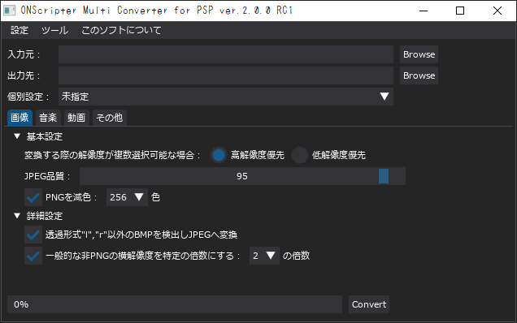

# ONScripter_Multi_Converter
## ツールについて
 特定の端末のONScripter向けに~~今更~~制作された総合変換ツールです。<br>
 一応[C&D; Tools Win GUI](https://web.archive.org/web/20170419120050fw_/http://www.geocities.jp/stm_torm/ons/tool.html)の後継を目指し作りました<br>


## 動作環境
 対応OS等の細かい検証は特に行っていません<br>
 多分windows10以降なら普通に動くと思います<br>
 <br>
 [制作/検証に使用した作者のPC環境]<br>
 PCスペック: <br>
 [](https://valid.x86.fr/izbfap)<br>
 FFmpeg-version: version 7.1-full_build<br>
 Python-version: Python 3.13.2<br>


## 動作に必要なもの
### 必須
 - "ONScripter_Multi_Converter" exe本体 [[DL (Assetsから)]](https://github.com/Prince-of-sea/ONScripter_Multi_Converter/releases/latest)
 - GARbro.Console [[DL (Googleドライブ)]](https://drive.usercontent.google.com/u/0/uc?id=1gH9nNRxaz8GexN0B1hWyUc3o692bkWXX&export=download)
 - FFmpeg / FFprobe [[DL (gyan.dev)]](https://www.gyan.dev/ffmpeg/builds/ffmpeg-release-full.7z)
 - smjpeg_encode [[DL (archive.org)]](http://web.archive.org/web/20130203074100/http://www.geocities.jp/stm_torm/ons/smjpeg4.zip)
 - nsaed [[DL (archive.org)]](https://web.archive.org/web/20130328141650/http://www.geocities.jp/stm_torm/nsaed2.zip)
 - NScripterで制作された、またはONScripter用に変換されたゲーム

### 任意
 - gscScriptCompAndDecompiler-cli [[DL (Assetsから)]](https://github.com/PC-CNT/gscScriptCompAndDecompiler-cli/releases/tag/pr12)
 - DirectorCastRipper_D10 [[DL (Assetsから)]](https://github.com/n0samu/DirectorCastRipper/releases/tag/v2.5)
 - mjdisasm [[DL (View rawから)]](https://github.com/Inori/FuckGalEngine/blob/master/Majiro/mjdev/mjdisasm.exe)
 - igscriptD [[DL (Assetsのigtools.zipの中)]](https://github.com/lennylxx/IG_tools/releases/tag/v1.0.0)
 - Kikiriki [[DL (archive.org)]](https://web.archive.org/web/20140714111942/http://tlwiki.org/images/7/7d/Kikiriki.rar)


## 使い方
### 変換前準備
 DLしたファイルをそれぞれの場所に展開/移動し、<br>
 最終的にファイルを以下のような配置にして準備完了です<br>
 (ディレクトリの場所は問いません)
```
[パスの通ってるディレクトリ]
   ffmpeg.exe
   ffprobe.exe


[適当な名前のツール用ディレクトリ]
│  ONScripter_Multi_Converter.exe
│  
└─tools
    │  gscScriptCompAndDecompiler.exe (任意)
    │  igscriptD.exe (任意)
    │  mjdisasm.exe (任意)
    │  nsaed.exe
    │  smjpeg_encode.exe
    │  
    ├─DirectorCastRipper_D10 (任意)
    │  │  DirectorCastRipper.exe
    │  │  {その他いくつかのファイル}
    │  │  
    │  └─{その他いくつかのディレクトリ}
    │                  
    ├─Garbro_console
    │  │  GARbro.Console.exe
    │  │  {その他大量のファイル}
    │  │  
    │  └─{その他いくつかのディレクトリ}
    │          
    └─Kikiriki (任意)
            kikiriki.exe
            madCHook.dll
```
 ※ffmpeg、ffprobeはtools直下(nsaedやsmjpeg_encodeと同じところ)に入れても認識します<br>
 また、パスの通る場所とtools直下両方に存在する場合はtools直下が優先されます<br>

 ※(任意)と書いてあるものは一部の個別設定で使用します<br>
 個別設定を利用しない場合必要ありません<br>


### ツールの設定
 <br>
 ※画像は古いバージョンや開発中バージョンの場合があります<br>
 
 [こちらに詳しく書いてあります](./README_setting.md)<br>
~~よくわからないならハード変更だけしてあと入力/出力指定してconvert押せばいいと思います~~


## 注意事項など
### 仕様
 - 本ツールは以下のバージョンのONScripterで動作させることを想定して作っています
    - PSP: onscripter-20110111_psp
    - PSVITA: ONScripter-jh-PSVita (yuri) v0.5.1.3 ※日本語で確認
    - Brain: onscripter-20100510-424x318 / onscripter-20100510-qvga
    - Android: ONScripter v20240906

 - 自由な解像度指定に対応していないハードでは、対応しているゲームの解像度は基本的には4種類のみです<br>
 以下の解像度以外は変換が行えないと思ってください<br>
 ※一応v2.0.0以降は**PSPのみ**横解像度が640または800から+-10の場合に強制変換できるようになっています<br>
    - 800x600
    - 640x480
    - 400x300 ~~←正直怪しい~~
    - 320x240 ~~←これも正直怪しい~~

 - 解像度が対応しているゲーム作品であっても、<br>
 そのソフトが正常に動作するとは限りません<br>
 (ONSの仕様上、DLLとかlua依存の作品は無理)<br>

 - Cドライブの空き容量に余裕をもった状態でご使用ください<br>
 特に個別設定を使う作品は変換方法次第で一時的に最大25GB程度消費する可能性があります<br>

 - 本ツールは日本語専用です<br>

### CD-DAを使っているソフトについて
ONScripter側の[CD audio 演奏の振り替え機能](https://web.archive.org/web/20231102082402if_/https://onscripter.osdn.jp/onscripter.html#cd-audio-mapping)を利用するため、<br>
先に吸い出した音源(wav)を入力先に用意しておいてください<br>
oggなどへの変換は本ツールが行うため事前の変換は不要です<br>

### 既知の不具合
 - avi、mpegplay、rnd2など一部関数を元々defsubで上書きしていた場合、本ツールの機能と競合する
 - nsa/sar/ns2アーカイブの外にあるnbzは処理不能
 - 個別設定欄のいくつかの文字が"?"になっている(動作には影響なし)
 - パス内に文字列"&"が入っている音源や動画の変換に失敗する
 - 一部の日本語の入ったsarファイルが正常な名前で展開できない(GARbro側の不具合?)

### お約束
 - 本ツールの使用において生じた問題や不利益などについて、<br>
 製作者は一切その責任を負わないものとします<br>
 また、それらの問題を他のツールの製作者様や<br>
 メーカー/サークル様に問い合わせるのは**絶対にやめてください**<br>

### 最後に
~~...今更PSP/VITAで変換してまでノベルゲームやるやついる？~~<br>